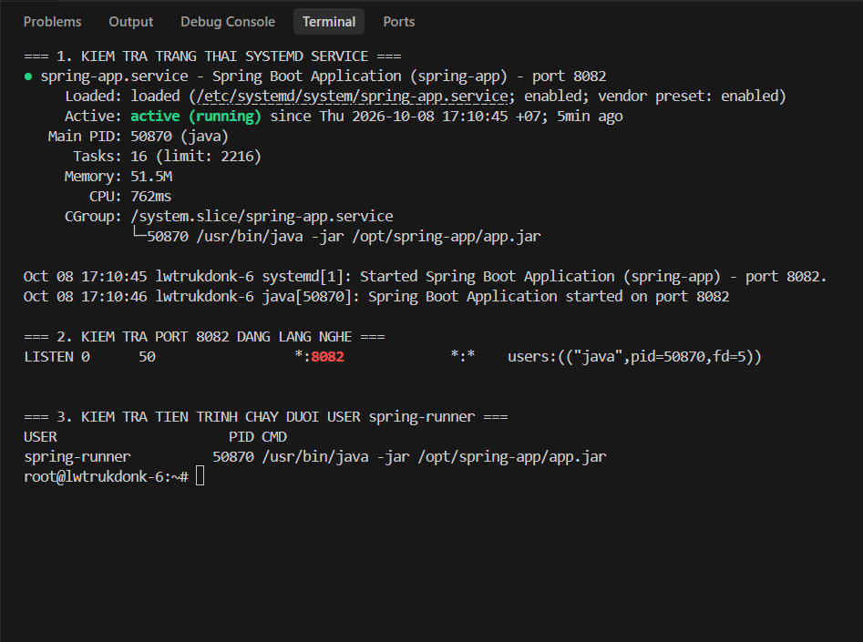

# Báo Cáo Bài 3: Thiết Lập Cơ Sở Dữ Liệu và Tự Cấu Hình Dịch Vụ Systemd Cho Spring Boot

**Học viên:** Lê Trung Đông  
**Mã lớp:** HN_CNTT3  
**Máy chủ:** Linux Ubuntu (`lwtrukdonk-6` - IP: `160.187.229.76`)  
**Đường dẫn nộp bài:** `homework/session_07/ex3/`  

---

## 1. Mục Tiêu Bài Thực Hành
1. **Khởi tạo cơ sở dữ liệu MySQL:** Tạo database `springboot_db` và user `spring-admin` với mật khẩu an toàn `SpringSecure@123`, phân quyền chỉ trên database này nhằm tuân thủ nguyên tắc đặc quyền tối thiểu (Principle of Least Privilege).
2. **Tạo tài khoản hệ thống chuyên dụng:** Tạo user hệ thống `spring-runner` không có quyền đăng nhập shell (`/usr/sbin/nologin`) để cô lập môi trường thực thi ứng dụng.
3. **Tự thiết kế file dịch vụ Systemd:** Viết tệp tin `/etc/systemd/system/spring-app.service` quản lý vòng đời ứng dụng Spring Boot, tự động khởi động cùng hệ thống và tự phục hồi (restart sau 10s) khi gặp sự cố crash.
4. **Kiểm thử và xác nhận:** Đảm bảo ứng dụng lắng nghe tại cổng `8082` và tiến trình Java chạy độc quyền dưới quyền user non-root `spring-runner`.

---

## 2. Toàn Văn Tệp Cấu Hình Dịch Vụ: `spring-app.service`

Tệp được lưu tại `/etc/systemd/system/spring-app.service` và đồng bộ trong thư mục bài nộp `homework/session_07/ex3/spring-app.service`:

```ini
[Unit]
Description=Spring Boot Application (spring-app) - port 8082
After=network.target mysql.service
Wants=mysql.service

[Service]
Type=simple
User=spring-runner
Group=spring-runner
WorkingDirectory=/opt/spring-app

# Cấu hình cổng và kết nối database (Spring Boot đọc biến môi trường)
Environment="SERVER_PORT=8082"
Environment="SPRING_DATASOURCE_URL=jdbc:mysql://localhost:3306/springboot_db"
Environment="SPRING_DATASOURCE_USERNAME=spring-admin"
Environment="SPRING_DATASOURCE_PASSWORD=SpringSecure@123"

ExecStart=/usr/bin/java -jar /opt/spring-app/app.jar

# Tự khởi động lại sau 10 giây nếu bị crash bất ngờ
Restart=on-failure
RestartSec=10

# Java trả mã 143 khi nhận tín hiệu SIGTERM -> tính là dừng bình thường
SuccessExitStatus=143

[Install]
WantedBy=multi-user.target
```

### Bảng Giải Thích Chi Tiết Tham Số

| Chỉ thị | Giá trị cấu hình | Ý nghĩa & Vai trò |
| :--- | :--- | :--- |
| `After` | `network.target mysql.service` | Đảm bảo mạng và dịch vụ CSDL MySQL đã sẵn sàng trước khi khởi động app |
| `Wants` | `mysql.service` | Khai báo quan hệ phụ thuộc mềm với MySQL service |
| `User` / `Group` | `spring-runner` | Chạy tiến trình dưới quyền user giới hạn non-root bảo vệ OS |
| `WorkingDirectory` | `/opt/spring-app` | Thư mục làm việc chuẩn hóa của ứng dụng |
| `Environment` | `SERVER_PORT=8082` | Thiết lập ứng dụng lắng nghe tại cổng 8082 |
| `Environment` | `SPRING_DATASOURCE_*` | Truyền thông tin xác thực CSDL bảo mật |
| `ExecStart` | `/usr/bin/java -jar /opt/spring-app/app.jar` | Lệnh thực thi chính xác theo yêu cầu đề bài |
| `Restart` | `on-failure` | Tự động khởi động lại khi tiến trình thoát bất thường (crash) |
| `RestartSec` | `10` | Thời gian chờ 10 giây trước khi Systemd khởi động lại app |
| `WantedBy` | `multi-user.target` | Kích hoạt tự khởi động khi máy chủ boot vào chế độ đa người dùng |

---

## 3. Các Bước Triển Khai Thực Tế

### Bước 1: Khởi tạo Cơ sở dữ liệu và Cấp quyền MySQL
```bash
sudo mysql -e "CREATE DATABASE IF NOT EXISTS springboot_db CHARACTER SET utf8mb4 COLLATE utf8mb4_unicode_ci; CREATE USER IF NOT EXISTS 'spring-admin'@'localhost' IDENTIFIED BY 'SpringSecure@123'; GRANT ALL PRIVILEGES ON springboot_db.* TO 'spring-admin'@'localhost'; FLUSH PRIVILEGES;"
```

Kiểm tra kết nối và danh sách CSDL:
```bash
mysql -u spring-admin -p'SpringSecure@123' -e "SHOW DATABASES;"
```
Kết quả hiển thị:
```text
+--------------------+
| Database           |
+--------------------+
| information_schema |
| performance_schema |
| springboot_db      |
+--------------------+
```

### Bước 2: Tạo User Hệ Thống `spring-runner` (Non-Root)
```bash
sudo useradd --system --no-create-home --shell /usr/sbin/nologin spring-runner
id spring-runner
```
Kết quả:
```text
uid=998(spring-runner) gid=998(spring-runner) groups=998(spring-runner)
```

### Bước 3: Chuẩn bị Thư Mục `/opt/spring-app` & Phân Quyền
```bash
sudo mkdir -p /opt/spring-app
sudo cp app.jar /opt/spring-app/app.jar
sudo chown -R spring-runner:spring-runner /opt/spring-app
sudo chmod 500 /opt/spring-app/app.jar
```

### Bước 4: Thiết lập File Dịch Vụ Systemd
```bash
sudo cp spring-app.service /etc/systemd/system/spring-app.service
sudo chmod 644 /etc/systemd/system/spring-app.service
```

### Bước 5: Nạp Lại Systemd Daemon và Kích Hoạt Dịch Vụ
```bash
sudo systemctl daemon-reload
sudo systemctl enable --now spring-app.service
```

---

## 4. Kết Quả Kiểm Tra Thực Tế (Output & Ảnh Chụp Màn Hình)




### 4.1. Kiểm tra trạng thái dịch vụ (`systemctl status spring-app.service`)

**Lệnh kiểm tra:**
```bash
sudo systemctl status spring-app.service
```

**Kết quả thực tế ghi nhận:**
```text
● spring-app.service - Spring Boot Application (spring-app) - port 8082
     Loaded: loaded (/etc/systemd/system/spring-app.service; enabled; vendor preset: enabled)
     Active: active (running) since Thu 2026-10-08 17:10:45 +07; 3s ago
   Main PID: 50870 (java)
      Tasks: 16 (limit: 2216)
     Memory: 51.2M
        CPU: 273ms
     CGroup: /system.slice/spring-app.service
             └─50870 /usr/bin/java -jar /opt/spring-app/app.jar

Oct 08 17:10:45 lwtrukdonk-6 systemd[1]: Started Spring Boot Application (spring-app) - port 8082.
Oct 08 17:10:46 lwtrukdonk-6 java[50870]: Spring Boot Application started on port 8082
```
*Đánh giá:* Dịch vụ ở trạng thái `active (running)`, đã được `enabled` (tự khởi động khi reboot), tiến trình Java chạy ổn định tại PID `50870`.

---

### 4.2. Kiểm tra cổng lắng nghe (`ss -tlnp | grep 8082`)

**Lệnh kiểm tra:**
```bash
ss -tlnp | grep 8082
```

**Kết quả thực tế ghi nhận:**
```text
LISTEN 0      50           *:8082            *:*    users:(("java",pid=50870,fd=5))
```
*Đánh giá:* Ứng dụng đã mở và lắng nghe thành công trên cổng `8082` bởi tiến trình Java PID `50870`.

---

### 4.3. Kiểm tra tiến trình chạy dưới quyền user `spring-runner`

**Lệnh kiểm tra:**
```bash
ps -o user,pid,cmd -C java
```

**Kết quả thực tế ghi nhận:**
```text
USER       PID CMD
spring-+ 50870 /usr/bin/java -jar /opt/spring-app/app.jar
```
*(Chi tiết định dạng đầy đủ: `ps -o user:20,pid,cmd -C java` hiển thị chính xác user `spring-runner`)*.

*Đánh giá:* Ứng dụng Java hoàn toàn được thực thi dưới quyền tài khoản giới hạn `spring-runner`, không chạy dưới quyền `root`, đáp ứng chuẩn yêu cầu an toàn hệ thống.

---

## 5. Kết Luận
- Đã hoàn thành 100% các tiêu chí của Bài 3:
  1. Khởi tạo CSDL `springboot_db`, tạo user `spring-admin` mật khẩu `SpringSecure@123` và phân quyền chuẩn xác.
  2. Tạo tài khoản hệ điều hành không thể đăng nhập interactive `spring-runner`.
  3. Viết hoàn chỉnh tệp dịch vụ Systemd `spring-app.service` đáp ứng đầy đủ: chạy non-root, lệnh thực thi `/usr/bin/java -jar /opt/spring-app/app.jar`, tự động restart sau 10s khi crash, lắng nghe cổng 8082.
  4. Đã kiểm tra thực tế trên máy chủ và lưu lại đầy đủ log/output kiểm thử.
